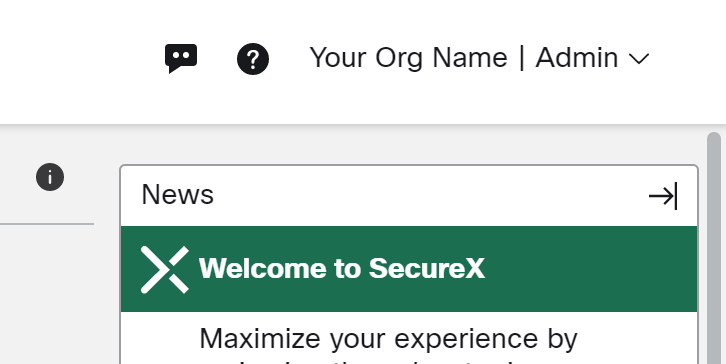

# AMP Health Checker for Windows

This tool was created to help sales personnel and customers but is ont an officially supported product. I will fix things on a best effort basis as I have time available.
If you've found this beneficial and want to say thanks, I like coffee!
https://www.buymeacoffee.com/mafranks

## SecureX End of Life issue August 2024

There have been some reports of the tool not working after SecureX End of Life. This is due to your API credentials being tied to a disabled SecureX account. To fix this, go to the new Secure Client portal in your region and generate new API credentials. Then, replace the old credentials in your .env file.
https://secure-client.us.security.cisco.com/administration/api-clients <- US region, change if necessary for EU and APJC.

## Private Cloud UPDATE December 2023

Made changes to allow for use with Private Cloud.  The .env file should contain a PC_DOMAIN and PC_CA_PATH as well as set "PC" for the region. The root certificate used for your Private Cloud needs to be accessible for the API calls to work properly.

## AUTHENTICATION UPDATE December 2022

Due to changes in the accessibility of the policy.xml file in the 8.1.3 release, authentication for the Health Checker tool had to be updated to include SecureX API authenticaiton. The SecureX API allows access to the policy.xml file which is required for proper operation of the tool. See the API Credentials section below for more information. 

The Device Control engine was also added in the Engines Check section.

## Introduction

You've successfully deployed AMP for Endpoints and it is now running on your system. Great! But, what is it actually doing? Most of the time it doesn't look like it is doing anything, but AMP is actually performing file checks constantly on the endpoint. The goal of this tool is to provide additional insight into AMP operations and allow customers to perform troubleshooting on their own. This should empower customers to self-resolve performance issues that would otherwise involve TAC engagement, and also provide visibility into AMP’s various activities.

This tool was developed by Matthew Franks (Advanced Threat Escalations) and Brandon Macer (Advanced Threat Escalations). With enough support and adoption, the long-term hope is to integrate this tool’s functionality into the Secure Client GUI.

## Disclaimer

This is not an officially supported tool and was developed as a side project, not as an official release by Cisco. Any support received will be on an as-available timeframe and feature requests may not be fulfilled.

## Installation

No installation is required. The tool can be downloaded or cloned from GitHub. If you'd like to make an EXE, you can do so with [PyInstaller](https://www.pyinstaller.org/):

> pyinstaller --onefile --noconsole --icon amp-icon.ico .\main_page.py

Current executable has been included in the files above for ease of use.

## Usage

To start the tool, ensure that you have an instance of AMP running and run the main_page.py script. If you have an executable from PyInstaller, right click the executable and Run as Administrator. You'll be presented with the GUI interface.

## Main Page GUI

### AMP Version

This displays the AMP version that is installed on your system.

### CPU Usage

This displays the CPU resources being consumed by the AMP process.

### AMP Uptime

This displays the length of time since the AMP process was started/restarted.

### Isolation

This displays either Not Isolated or Isolated depending on the current isolation status.

### Isolation Unlock Code

If isolated, the Isolation Code to unlock the connector will be displayed.

NOTE: Valid Secure Endpoint API Credentials are required for this functionality to work.

For additional information on Endpoint Isolation, please refer to the [Secure Endpoint User Guide](https://console.amp.cisco.com/help/en/wwhelp/wwhimpl/js/html/wwhelp.htm).

### TETRA Version

This displays the current TETRA definition version downloaded by the AMP connector. Click the Check TETRA Version button to check that against the version available in the cloud. If you have the latest version, it will be highlighted Green. If you have a version within the last five updates, it will be highlighted Yellow. If your version is more than five updates behind, it will be highlighted Red. Also, the current version will be displayed after the check.

NOTE: This functionality does not require API Credentials.

### Policy Serial

This displays the current Policy Serial number in place on the local connector. Click the Check Policy Version button to check that against the version available in the cloud. If you have the latest version, it will be highlighted Green. If your version is not the latest, it will be highlighted Red. Also, the latest version available will be displayed after the check.

NOTE: Requires Secure Endpoint API Credentials.

### API Credentials

This display will show if you have provided valid Secure Endpoint API Credentials. It will show either Valid or Invalid. Much of the tool functionality will require API credentials. These are provided in a .env file in the same directory as the python script or program executable, depending on how you're executing the program.

The .env file must have the following entries to pull the policy.xml which is no longer accessible locally as of the 8.1.3 release.

For Public Cloud:
    Enter a CLIENT_ID and API_KEY from the Secure Endpoint console.
    Enter a REGION (NAM, EU, or APJC).
    Enter a SX_CLIENT_ID and SX_API_KEY from the SecureX/XDR console.
    Enter an ORG_NAME for the SecureX/XDR Organization.

For Private Cloud:
    Enter a CLIENT_ID and API_KEY from the Private Cloud console.
    Enter "PC" for the region.
    Enter your PC_DOMAIN such as test.local.
    Enter the path to your Private Cloud root certificate, such as "C:/Users/xxxxx/Desktop/rootCA.crt"

> CLIENT_ID = "01234567890abcdef012"

> API_KEY = "12345678-abcd-abcd-abcd-1234567890ab"

> SX_CLIENT_ID = "client-12345678-abcd-abcd-abcd-01234567890a"

> SX_API_KEY = "Abcdef01234567-Abcdef01234567890abcdef01234567890abcde"

> ORG_NAME = "Your Org Name"

> REGION = "NAM"

> PC_DOMAIN = "test.local"

> PC_CA_PATH = "C:/Users/xxxxx/Desktop/rootCA.crt"

The CLIENT_ID and API_KEY will be generated in the [Secure Endpoints console](https://console.amp.cisco.com/api_credentials).

The SX_CLIENT_ID and SX_API_KEY will be generated in the [SecureX console](https://securex.us.security.cisco.com/settings/apiClients).

The ORG_NAME is your SecureX Organization name. Keep in mind you may have more than one organization so choose the appropriate one that matches your Secure Endpoint deployment. The SecureX Organization name is displayed in the top right corner of the SecureX console.

You can use the .env file as an example and just fill in your information.

The REGION is either NAM, EU, or APJC dpending on the region your deployment is located.

### Live Debugging

The Live Debugging button will bring you to a new popup. Within this popup, you can conduct performance troubleshooting. The statistics provided should give you an indication of the engine or action that is causing high system resource utilization.

To start, press the Start/Resume button. To pause, press Pause. To resume again, press Start/Resume. If you would like to save the scanned files to a text file, click Save As to save it locally on your system. Click Reset Data to reset the counters. Click Cancel to exit.

### Live Top Processes

Live top processes gives a quick view into the top processes being scanned by the AMP Connector. The controls are similar to the Live Debugging controls.

### Connectivity Test

The Connectivity Test button will allow you to run a connectivity test to the AMP servers. They will all show as yellow while the test is running. If they turn green, the connection was successful. If they turn red, the connection was unsuccessful.

NOTE: This does not validate whether or not traffic was altered on the way to the servers, so please be sure to bypass these addresses through your proxies.

### View Exclusions

The View Exclusions button allows you to view the path and process exclusions from the current policy on the endpoint.

### Generate Diagnostic

The Generate Diagnostic button allows you to generate an AMP Diagnostic bundle. This will place the zipped file on your desktop. It will also create an amp_health_checker_log.log file in the directory with the Health Checker scripts or executable. If you have an issue with the tool itself, please click the DEBUG button on the main page, recreate the issue, and provide the AMP diagnostic and the Health Checker log for analysis.

### Run Analysis

The Run Analysis button will give you a quick snapshot of the system based on the AMP sfc.exe.log files. The top 10 processes, files, extensions and folders scanned will be displayed.

NOTE: The logs need to be in debug to show the appropriate data.

### Top IPs

The Top IPs will show a list of the top ten IP addresses reached out to from files scanned by the AMP Connector.

### Check Engines

The Check Engines button will show each engine and whether or not it is enabled in the local policy. In the example below, Orbital is the only engine not enabled.

### Manual SFC Analysis

Manual SFC Analysis allows you to run analysis on a file from another machine or an old file from the same machine. The sfc.exe.log file from the local machine is selected by default but you can change this with the Change SFC File button. Click Analyze to run the analysis. Click Reset SFC File to reset the file back to the local sfc.exe.log file.

### Recommend Exclusions

Click to recommend Cisco Maintained Exclusions lists based on processes seen on the endpoint. The lists are currently provided by a hard-coded json. An API call for Cisco Maintained Exclusion details is on the roadmap so this will be used once available.

### Log Level

The log level buttons allow you to select the logging level for the AMP Health Checker tool. It does not change the log level on the AMP Connector! If you run into an issue with the Health Checker tool, please put the tool in DEBUG, reproduce the issue, and provide the AMP diagnostic file and Health Checker logs for analysis.

### Region

The region buttons allow you to switch between NAM, EU and APJC depending on which cloud your connector belongs to.

### Refresh

Refresh will refresh the data on the main page. This may be necessary if the Isolation Status changes while running the Health Checker or if you change Regions. This feature was introduced to prevent excessive resource utilization by the tool.

### Cancel

Cancel will exit the program.
